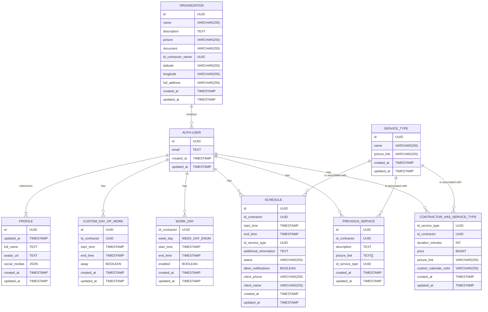

# SaaS template using ANTD, TailwindCSS, NextJS 14 and other opnionated libraries

Antd is is an excellent UI component library, the biggest when it comes to ecosystem and functionalities.

This repository integrates it with Tailwindcss, Globalization, themes, state management and caching tools as well as great plugins for ensuring code quality and enforcing rules.

**This project uses PNPM and TURBOPACK for local development for quicker times**

## Features

- [Next.js 14](https://github.com/vercel/next.js) `app` directory
- [Ant-Design 5](https://github.com/ant-design/ant-design)
- [Tailwind CSS](https://github.com/tailwindlabs/tailwindcss)
- Dark mode with [next-themes](https://github.com/pacocoursey/next-themes)
- Icons from [Lucide](https://lucide.dev)
- Typesafe globalization with [next-intl](https://github.com/amannn/next-intl)
- State management with [Zustand](https://github.com/pmndrs/zustand)
- Query caching and invalidation with [react-query](https://www.npmjs.com/package/@tanstack/react-query)
- Type and schema validation with [zod](https://zod.dev/)
- Antd form integration with [antd-zod](https://github.com/MrBr/antd-zod)
- Typesafe validated env variables for server and client with [t3-env](https://env.t3.gg/docs/nextjs)
- Git hooks with [husky](https://github.com/typicode/husky)
- Conventional commit enforcement with [commitlint](https://github.com/conventional-changelog/commitlint)
- CLI interface for quick conventional commits with [commitzen](https://github.com/commitizen/cz-cli)
- Automatic import sorting with [@trivago/prettier-plugin-sort-imports](https://github.com/trivago/prettier-plugin-sort-imports)
- Globalization sorting and linting with [eslint-plugin-i18n-json](https://www.npmjs.com/package/eslint-plugin-i18n-json)
- Pre-commit lint and prettier checks with [lint-staged](https://github.com/lint-staged/lint-staged)

# Codebase convetions and enforced rules

All files inside the [server](/src/server/) folder should have the `'use server'` directive on top, as them will only be served to the backend and callable from the front end.

Branch names should follow this convention:
`^((hotfix|bugfix|fix|feature|improvement|chore|style|refactor)\/[a-zA-Z0-9_\-]+)|(main)$`.

Ex: `hotfix-auth-component` | `feature-schedulling` | `main`

Commit messages should follow the [conventional commits](https://www.conventionalcommits.org/en/v1.0.0/) naming style. You can also use `pnpm commit` for a cli interface for commit naming.

Files and folders in general should follow the `kebab-case` name convention, only react `.tsx` files inside the `components` folder should follow the `SnakeCase` naming convetion.

## Database Model




## Run 

Node version: 20.9.0

Install [pnpm](https://pnpm.io/installation), if it is not installed yet.

Install dependencies:
```
pnpm install
```

Run dev mode: 
```
pnpm dev
```